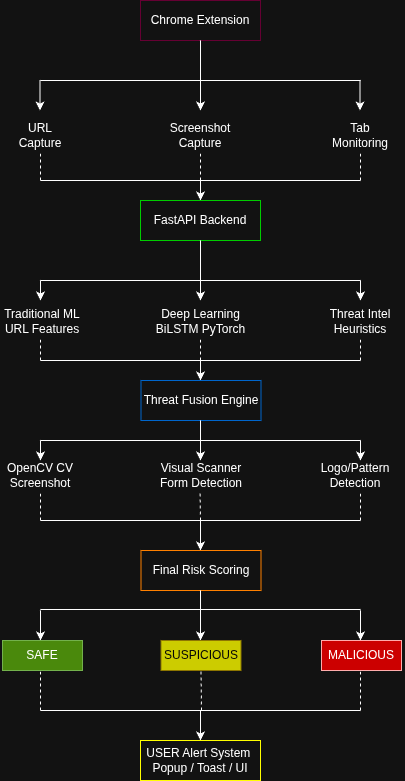
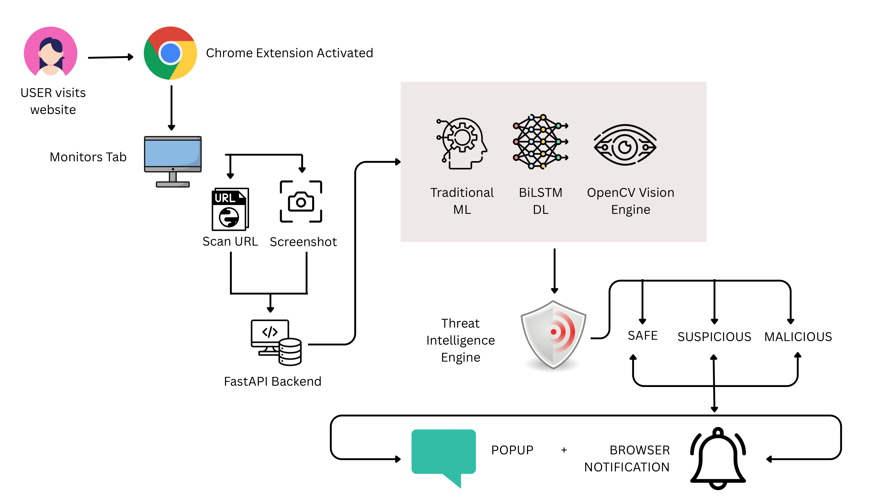

<div align="center">
  <h1> WEBGuard (PhishGuard)</h1>
  <p><em>An AI-Powered Phishing Detection Platform & Browser Extension</em></p>
  <p>
    <strong>Machine Learning</strong> • <strong>Computer Vision</strong> • <strong>Real-time Protection</strong>
  </p>
</div>

---

##  Overview

**WEBGuard** is a comprehensive, production-grade phishing detection platform designed to protect users from malicious websites in real-time. By combining *Machine Learning* for URL feature analysis and *Deep Learning* (Computer Vision) for visual page inspection, WEBGuard provides robust, multi-layered security directly within your browser.

---

##  Features

- ** Real-time URL Analysis**: Extracts and analyzes URL-based security features on the fly.
- ** Visual Screenshot Inspection**: Employs Computer Vision to visually assess the webpage for deceptive patterns.
- ** Browser Extension Integration**: Seamless, lightweight Chrome extension offering automated monitoring and threat notifications.
- ** Tri-Level Threat Classification**:
  -  **SAFE**: Minimal phishing indicators.
  -  **SUSPICIOUS**: Unusual characteristics needing caution.
  -  **MALICIOUS**: Strong malicious patterns detected.

---

##  Architecture & Workflow

Understanding how **WEBGuard** operates under the hood.

### System Architecture


### Processing Workflow


---

##  Tech Stack

WEBGuard leverages a modern and powerful technology stack across its architecture:

###  Backend (AI & API)
<p align="left">
  
  
  
  
  
</p>

###  Frontend (Dashboard)
<p align="left">
  
  
  
</p>

###  Browser Extension
<p align="left">
  
  
</p>

###  DevOps
<p align="left">
  
</p>

---

##  Screenshots

Here are some visual demonstrations of **WEBGuard** in action:

<details>
<summary><b>Click to expand screenshots</b></summary>
<br>

<div align="center">
  
  <br><br>
  
  <br><br>
  
  <br><br>
  
  <br><br>
  
</div>

</details>

---

##  Getting Started

### Prerequisites
- Node.js & npm (for Frontend)
- Python 3.9+ (for Backend)
- Google Chrome browser (for Extension)
- **Docker & Docker Compose** (Optional, for containerized setup)

### 🐳 Using Docker (Recommended)

To quickly spin up the entire application stack:
```bash
cd docker
docker-compose up --build
```
This will start both the backend API and the frontend dashboard automatically.

### 💻 Manual Setup

<details>
<summary><b>1. Backend Setup</b></summary>
<br>

```bash
cd backend
python -m venv venv
source venv/bin/activate  # On Windows use `venv\Scripts\activate`
pip install -r requirements.txt
uvicorn app.main:app --reload
```
</details>

<details>
<summary><b>2. Frontend Setup</b></summary>
<br>

```bash
cd frontend
npm install
npm run dev
```
</details>

### 🧩 Extension Setup

1. Open Google Chrome and navigate to `chrome://extensions/`.
2. Enable **Developer mode** in the top right corner.
3. Click **Load unpacked** and select the `extension` folder from this repository.
4. Pin the **WEBGuard** extension to your toolbar.

---

##  Security Disclaimer

> **Note:** *WEBGuard is intended as a phishing detection and awareness platform. Predictions are generated using machine learning and computer vision models and should be treated as security recommendations rather than absolute guarantees.*

---

##  Contributing

Contributions, issues, and feature requests are welcome! Feel free to check the [issues page](https://github.com/SubrataSaha8191/PhishGuard/issues).

---

<div align="center">
  <sub>Built with  for a safer web environment.</sub>
</div>
